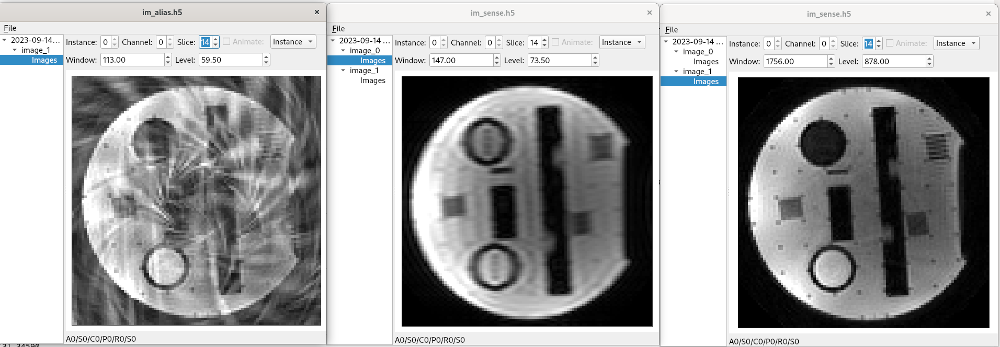

# Gadgetron reconstruction chain for peSpiral Sequence
This repo contains gadgetron gadgets to perform simple real-time gridding reconstrution for a custom 3D stack of spiral sequence. The gadgets are mainly adapted from the main [gadgetron repo](https://github.com/gadgetron/gadgetron.git) and [gadgeton online course](https://github.com/gadgetron/GadgetronOnlineClass/tree/master/Courses/Day4/Lecture1). It also has half-baked parallel imaging reconstruction with a help of [BART](https://github.com/mrirecon/bart.git) reconstruciton package.

### Gadgets
Please refer to [piv_GadgetronSpiral.xml](config/piv_GadgetronSpiral.xml). The following four gadgets are mainly modified.
```
+--------------------+     +----------------------------+    +----------------------------+   +---------------------------+
|                    |     |                            |    |                            |   |                           |
|RemoveRefOSGadget   |     |RefRecoGadget               |    | AddTrajInfoGadget          |   | SpiralGriddingGadget      |
|                    |     |                            |    |                            |   |                           |
|* removes readout   +-----+* Calcultes Coil sensitivity+----+ * Parse spiral design para +---+ * perform gridding reco or|
|  from GRE reference|     |  from reference scan by    |    | * Calculates trajectories  |   |  pass data to pics of BART|
|  scan              |     |  calling BART ecalib       |    |  and density compensation  |   | * do coil combination.    |
|                    |     |* Can also FFT reco the ref |    |  fucntion.                 |   |                           |
|                    |     |  Data                      |    |                            |   |                           |
+--------------------+     +----------------------------+    +----------------------------+   +---------------------------+

```
### Dependencies
- Gadgetron (build and runtime)
- BART (in runtime for pics reco)
- [ismrmrdviewer](https://github.com/ismrmrd/ismrmrdviewer.git)  (Optional)
- [siemens_to_ismrmrd](https://github.com/ismrmrd/siemens_to_ismrmrd.git)  (Optional)

## Demo 

### Building
```
git clone https://github.com/praveenivp/GenericSpiralReco.git
cd GenericSpiralReco && mkdir build && cd build
cmake -DCMAKE_BUILD_TYPE=Debug -GNinja ..
ninja
```
Make sure the output dll is visible to gadgetron.
 
### Reconstruction
Start gadgetron and feed it with data. First start get simple recon without BART. 
```
gadgetron_ismrmrd_client -f testData/raw3D_R3.h5 -C config/SimpleReco.xml -o im_alias.h5 
ismrmrdviewer im_alias.h5 &
```
If BART is on path, you can perform CG-SENSE reconstruction with `ecalib` and `pics`.
```
gadgetron_ismrmrd_client -f testData/raw3D_R3.h5 -C config/piv_GadgetronSpiral.xml -o im_sense.h5 
ismrmrdviewer im_sense.h5 &
```
#### Results
Aliased image, GRE reference image from auto calibation data and CG-SENSE reconstruction can be seen.


### troubleshooting
#### Create siemens data to MRD format
siemens raw data is already converted to MRD format!
```
siemens_to_ismrmrd -x parameter_maps/IsmrmrdParameterMap_peSpiral_VE11E.xsl -m parameter_maps/IsmrmrdParameterMap_peSpiral_VE11E.xml -f peSpiral.dat -z 1 -o data_z1.h5
ismrmrdviewer data_z1.h5 
```
##### BART 
Make sure you enable `calc_csm` and `do_pics` flags to get all necessary files in the `output folder` for pics.
```
bart pics -i 10  -p DCF -t Traj coil_data sensCFL pics_reco

```

## Online reconstruction

### Tunneling to your own Gadgetron
Turn off tunneling in `gadgetron.ini` file and make your own tunnel with ssh port forwarding. 
```
ssh -L 192.168.2.1:9010:localhost:9002 gadgetron@10.41.116.43
```

### deploying in docker-conda environment for online reconstruction
The following steps are only valid for our gadgetron setup!

Mount the folder and start the docker container
```
scp -r <folder_path> username@192.168.0.1:~/code
docker run --rm -v <GenericSpiralReco_PATH>:/code <container_image_id>
docker exec -ti <container_id> bash
```
Inside the container shell, make sure the linker (ld) points to the `ld` inside conda by `which ld`. Otherwise, pthread library path was incorrect(`ldconfig -p |grep pthread`)
```
conda activate gadgetron
export PATH="${CONDA_PREFIX}/x86_64-conda-linux-gnu/bin":$PATH
```
install missing build dependencies and compile. If successful, commit the `lib.so` to [gadgetron-gagets]() repo and restart gadgetron container via yacht.
```
apt update && apt install cmake libarmadillo-dev
cmake -DCMAKE_BUILD_TYPE=Release -DCMAKE_PREFIX_PATH=${CONDA_PREFIX} ..
make -j8
scp <libfile.so> gadgetron@10.41.xx.xx:/home/gadgetron/Documents/packages/gadgetron-gadgets/lib
```

## Todo  
- [x]  Accumulate data
- [x]  Add Trajectory information to Ismrmrd Reconbit
- [x]  Add nice NODE_PROPERTY for tunning gadgets with xml config.
- [x]  import and export functions for CFL files and h0NDArrays.
- [x]  Calculte coil maps from reference data using BART
- [x]  gridding reoconstruction
- [x]  coil combination with calculated sensitivity
- [x]  CG-SENSE reconstruction
- []  remove CFL_IO2.xx 
- []  multi-slice reco fix
- []  GIRF correction
- []  coil maps calculation not starting immediately
- []  Mosiacing doesn't work with reference image

## Author
* Praveen Iyyappan Valsala
* Modified version of [Spiral design package](https://github.com/mrphysics-bonn/spiraltraj.git) is from Philipp Ehses (philipp.ehses@dzne.de)
